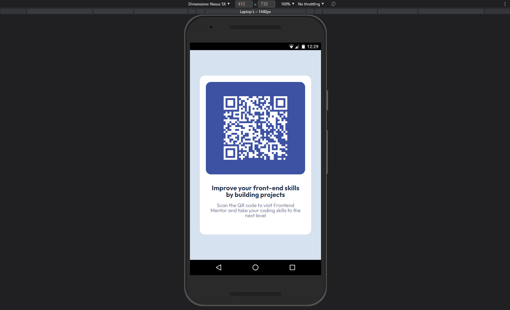

# Frontend Mentor - QR code component solution

This is a solution to the [QR code component challenge on Frontend Mentor](https://www.frontendmentor.io/challenges/qr-code-component-iux_sIO_H). Frontend Mentor challenges help you improve your coding skills by building realistic projects. 

## Table of contents

- [Overview](#overview)
  - [Screenshot](#screenshot)
- [My process](#my-process)
  - [Built with](#built-with)
  - [Useful resources](#useful-resources)
- [Author](#author)

## Overview

### Screenshot

#### Desktop

#### Mobile

## My process

### Built with

- Semantic HTML5 markup
- CSS custom properties
- Flexbox
- CSS Grid
- [React](https://reactjs.org/) - JS library
- [Styled Components](https://styled-components.com/) - For styles

### Useful resources

- [qrcode.react](https://github.com/zpao/qrcode.react) - This helped me to make the QR dynamic.
## Author

- LinkedIn - [@andreysilveira](https://www.linkedin.com/in/andreysilveira/)
- Frontend Mentor - [@andreysilveira](https://www.frontendmentor.io/profile/andreysilveira)
- Twitter - [@yerdna_arievlis](https://twitter.com/)